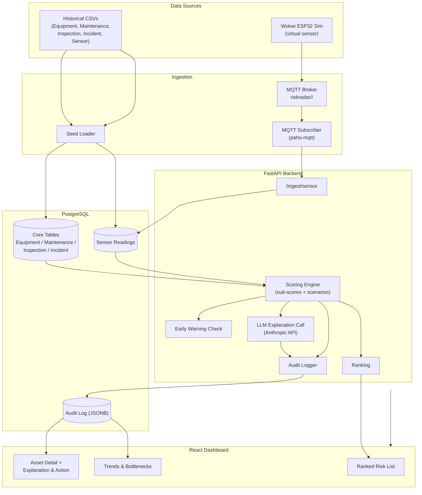
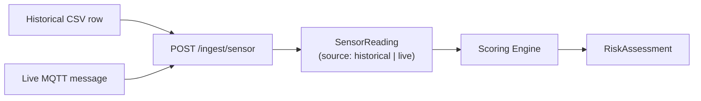
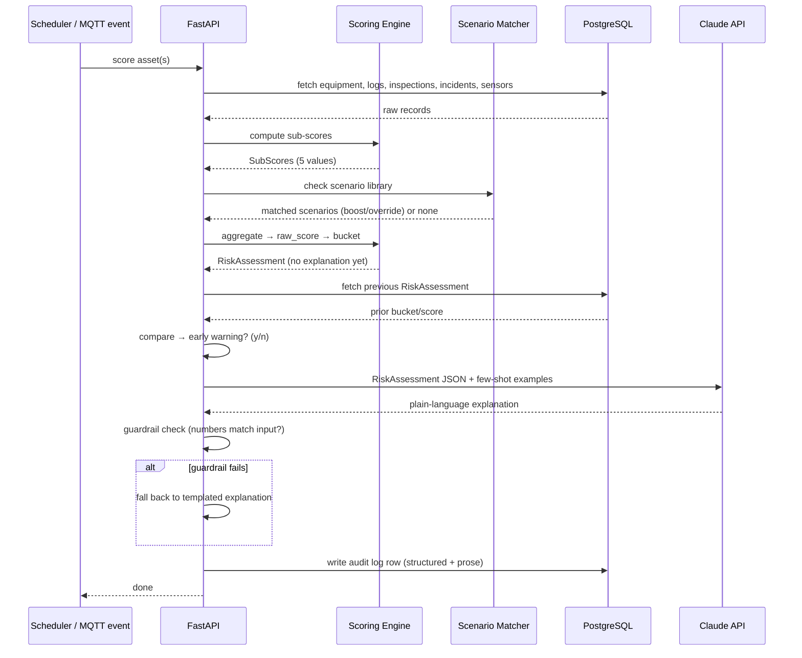
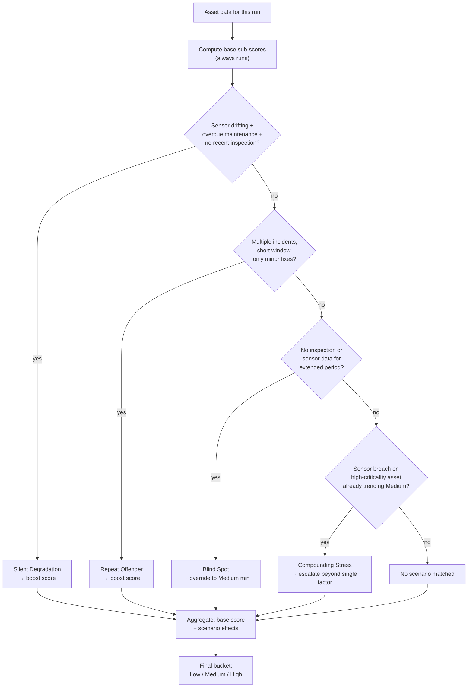
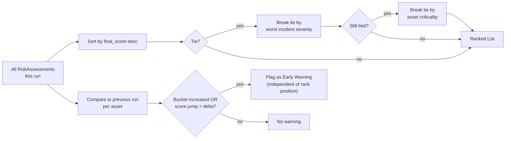

# RiskRadar — Diagrams

Companion diagrams to `riskradar-tech-stack-and-specs.md`. All are plain Mermaid — paste into any Mermaid-compatible renderer (GitHub, Notion, mermaid.live, etc.).

---

## 1. System Architecture

---

## 2. Historical vs. Live Data Convergence

---

## 3. Scoring Engine — Sequence per Asset

---

## 4. Scenario Matching Logic

---

## 5. Ranking & Early Warning Flow

